# NBA Players cards shop

- [NBA Players cards shop](#nba-players-cards-shop)
  - [Demo Screenshots](#demo-screenshots)
  - [Build with](#build-with)
  - [Installation](#installation)
  - [Pre-seed data:](#pre-seed-data)
  - [Links](#links)

## Demo Screenshots
GUESTS:

Home + Footer
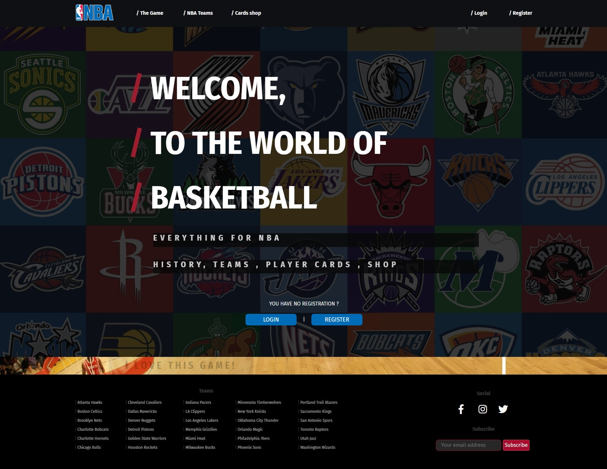

The Game
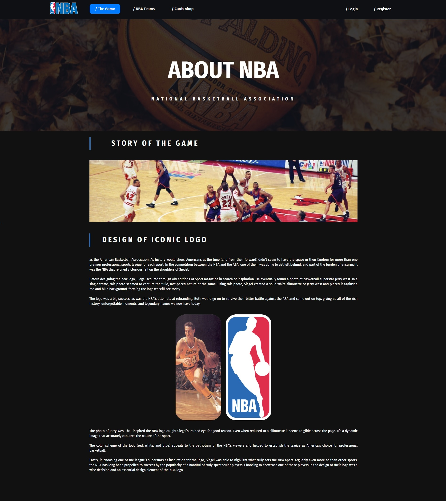

NBA Teams
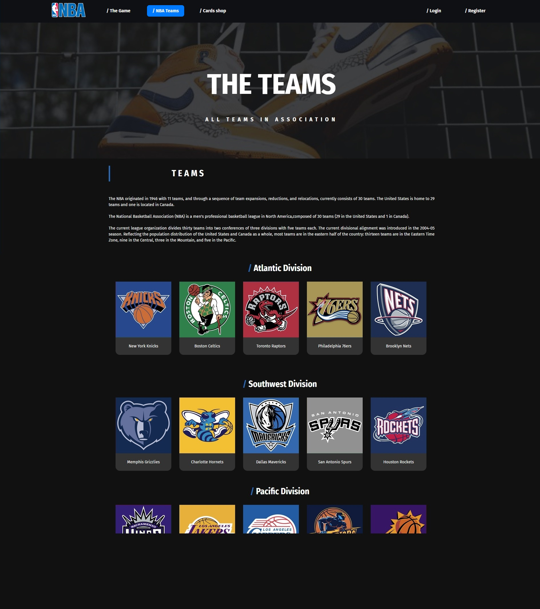

Team Details
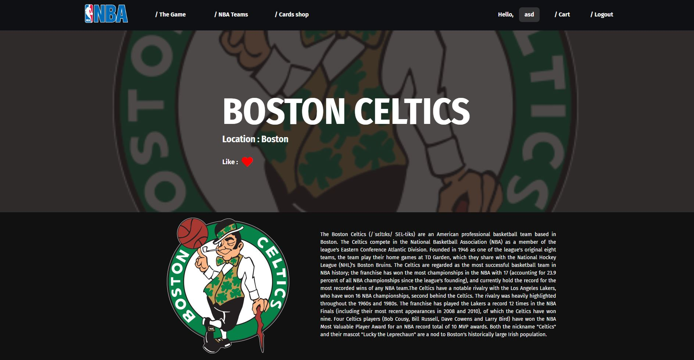

404 - Not Found
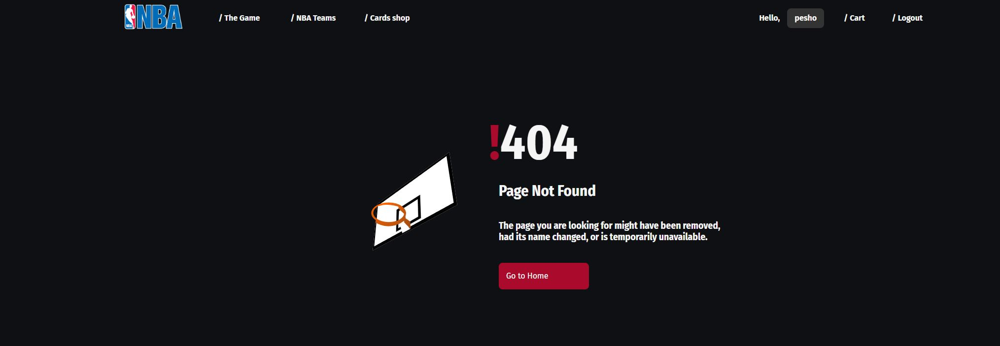

Register
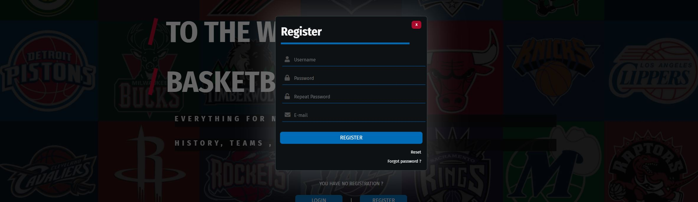

Login
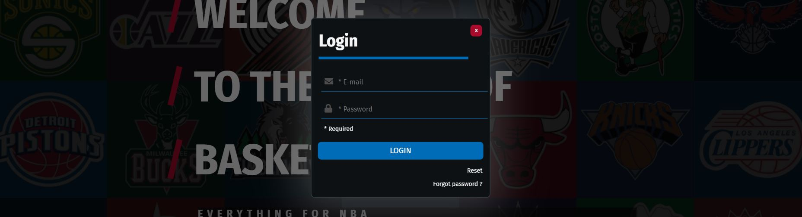

LOGGED USERS:

Create Card
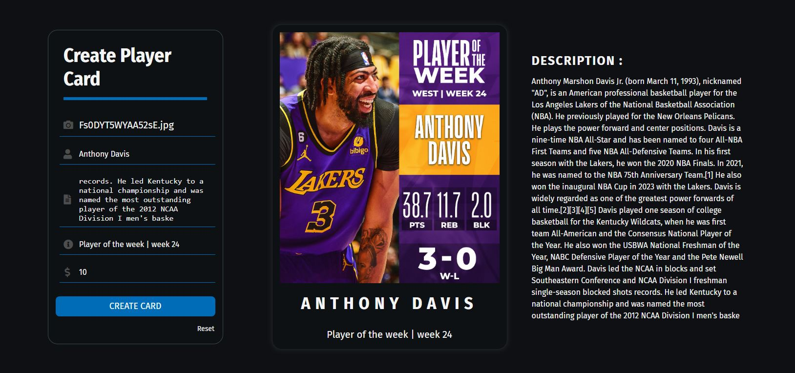

User Profile
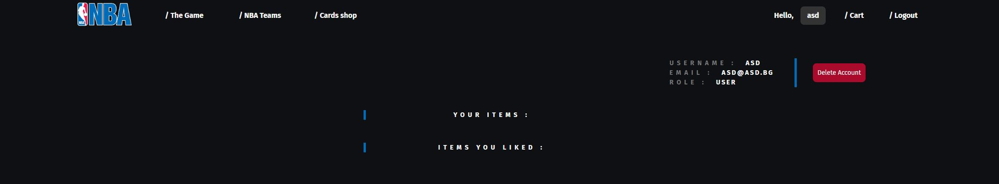

Card Details
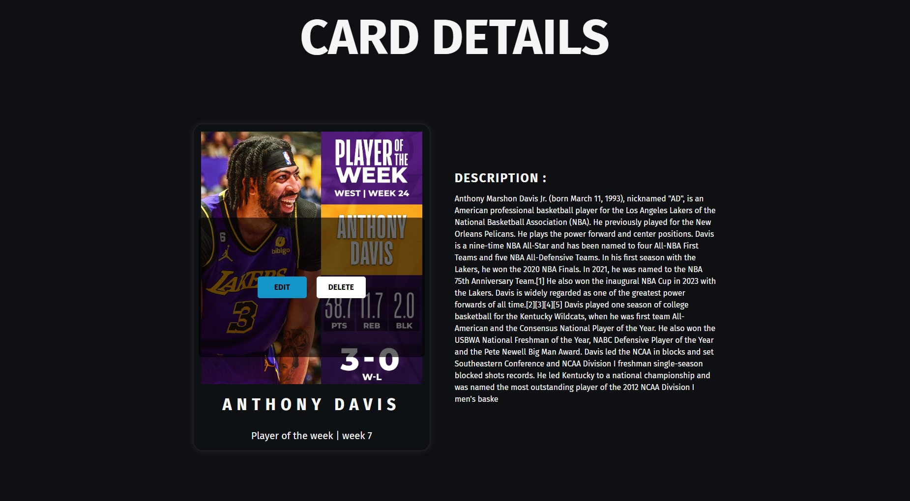

Edit Card
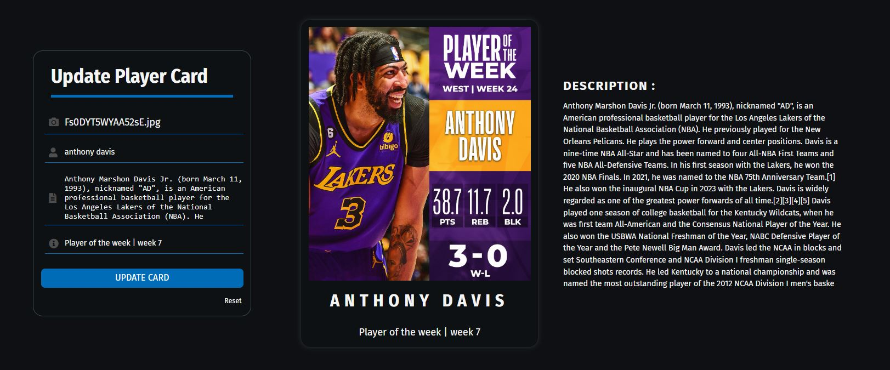

Delete Card
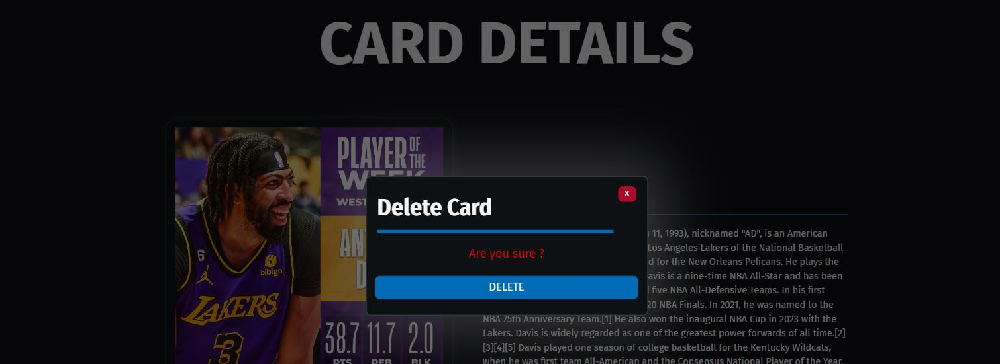

Cards Shop
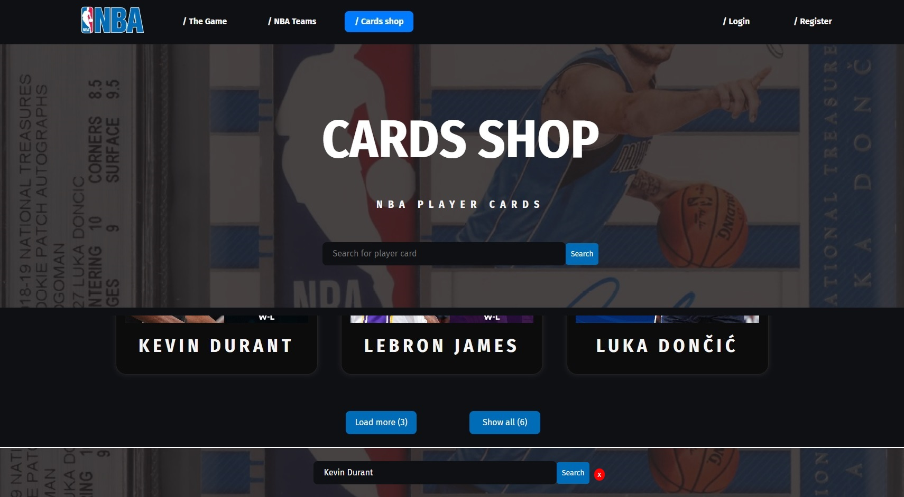

Mini Cart and badge
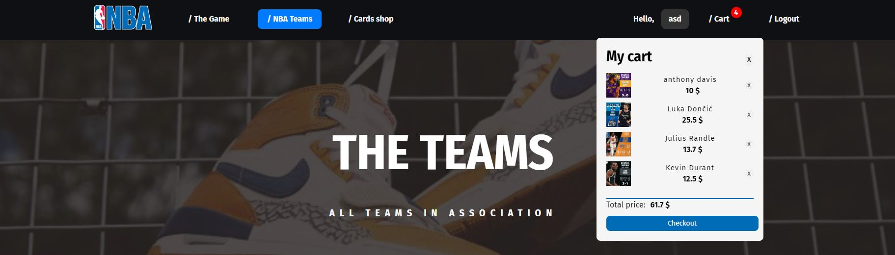

Cart


User Profile Delete
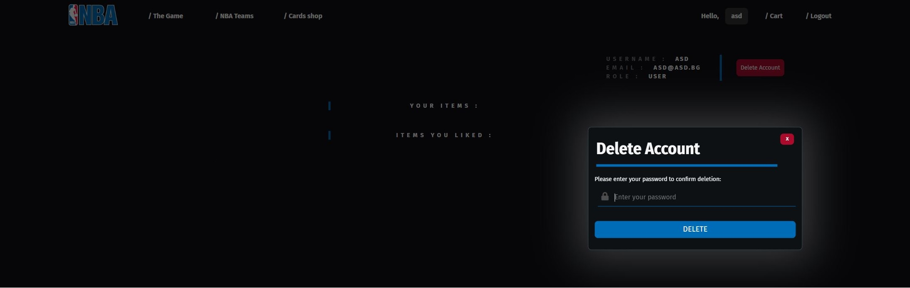

ADMIN :

Admin profile
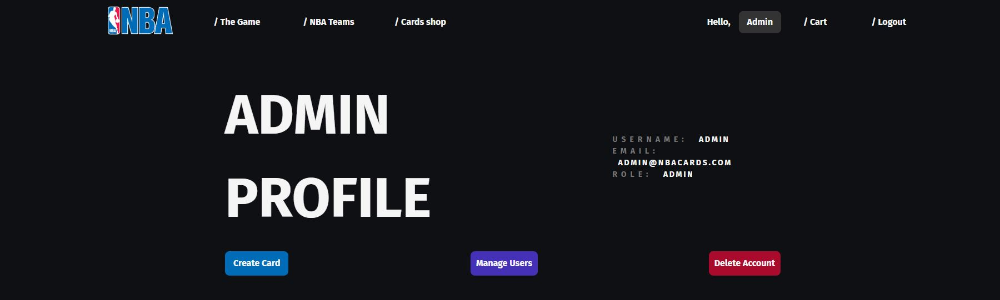

Manage users
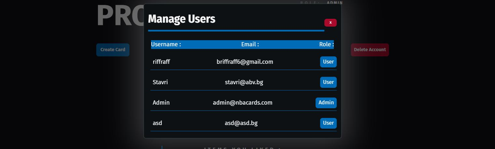


LOGGED USERS :

Logout
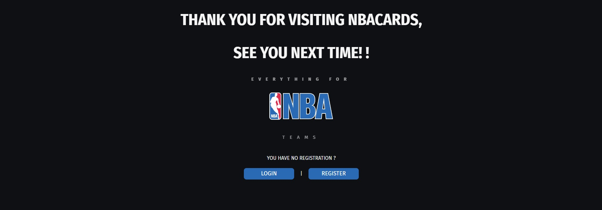

## Build with 

[Vite](https://vitejs.dev/)

[React](https://react.dev/)

[Firebase](https://firebase.google.com/)

- [Authentication](https://firebase.google.com/products/auth)
- [Database](https://firebase.google.com/products/firestore)
- [Storage](https://firebase.google.com/products/storage)


[Sass](https://sass-lang.com/)

[CSS](https://bg.wikipedia.org/wiki/CSS)

[HTML](https://bg.wikipedia.org/wiki/HTML)

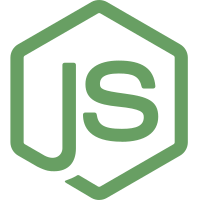[JavaScript](https://bg.wikipedia.org/wiki/JavaScript)

## Installation

Step-by-step instructions on how to set up the project locally.

```bash

# Clone the repository
git clone git@github.com:briffraff/NBA-Player-Cards.git

# Navigate to the project directory
cd NBA-Player-Cards

# install needed dependencies
npm install

# run vite local host
npm run dev

# open broject in browser
http://localhost:5173/

```

## Pre-seed data:
```bash

## 2x USERS :
--- Admin
"e-mail" : admin@nbacards.com
"password": admin123

--- User
"e-mail": asd@abv.bg
"password": asdasd

"e-mail": stavri@abv.bg
"password": asdasd

## 30x NBA TEAMS :

Atlanta Hawks
Boston Celtics
Brooklyn Nets
Charlotte Hornets
Chicago Bulls
Cleveland Cavaliers
Dallas Mavericks
Denver Nuggets
Detroit Pistons
Golden State Warriors
Houston Rockets
Indiana Pacers
LA Clippers
Los Angeles Lakers
Memphis Grizzlies
Miami Heat
Milwaukee Bucks
Minnesota Timberwolves
Charlotte Bobcats
New York Knicks
Oklahoma City Thunder
Orlando Magic
Philadelphia 76ers
Phoenix Suns
Portland Trail Blazers
Sacramento Kings
San Antonio Spurs
Toronto Raptors
Utah Jazz
Washington Wizards

## 2x SUBSCRIBERS :
"e-mail": admin@nbacards.com
"e-mail": asd@nbacards.com

## 6x PLAYER CARDS :
Anthony Davis
Luka Doncic
Julius Randle
Lebron James
Kevin Durant
Giannis Antetokoumpo

```
## Links
https://www.svgrepo.com/

https://nba.com
